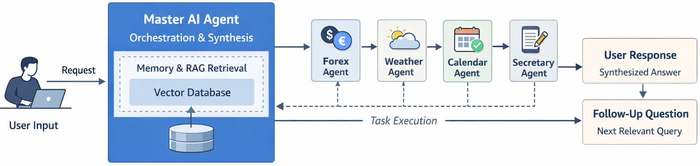
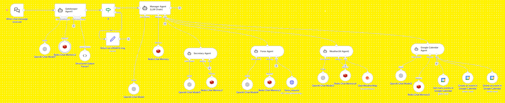

# Multi-Agent Orchestration Building Block

**A reusable building block for enterprise-grade multi-agent orchestration workflows using n8n.**

Demonstrates how a **Master AI Agent** can coordinate multiple **specialized AI Agents**, and handle **context-aware follow-up questions** — similar to ChatGPT-style conversational flows.

---

## Architecture Overview

- **Master AI Agent**: Orchestrates user requests, decomposes tasks, calls specialized agents, collects outputs, synthesizes responses, and generates follow-up questions.
- **Specialized AI Agent Tools**: Task-specific agents:
  - `Forex Agent` – currency conversion / exchange rates
  - `Weather Agent` – weather queries
  - `Google Calendar Agent` – Meeting scheduling / updating & removing scheduled events
  - `Secretary Agent` – general knowledge / research

  

<em>
Figure 1: Solution Architecture building block.
</em>

- **Workflow Execution**:

  

<em>
Figure 2: N8N Workflow.
</em>

---

## Setup & Usage

1. **Import Workflow**:
   - Open n8n
   - Import `workflow/multi_agent_workflow.json`

2. **Configure API Keys**:
   - OpenAI API key (for embeddings & chat)
   - Redis API key (short term memory)
 
3. **Memory Configuration**:
   - Enable memory node (Redis conversational memory)
   - Best to add vector memory for embedding-based context retrieval (than retrieving whole previous conversations - Memory bloating)

4. **Run Workflow**:
   - Trigger user input
   - Master AI Agent orchestrates tasks, calls tools, and returns synthesized response
   - Supports multi-turn conversations with follow-up questions

---

## Sample Test Scenario

| User Prompts                                     | Expected Agent Assignment | 
|--------------------------------------------------|---------------------------|
| How much INR will I get for 500 USD?             | Forex Agent               | 
| Will it rain in Bangalore today?                 | Weather Agent             | 
| Book a meeting with Ram tomorrow at 5 PM         | Google Calendar Agent     | 
| Which is the most Ancient civilization in India? | Secretary Agent           | 

## Design Considerations

- **Modular & Reusable**: Master + tools can be extended with new specialized agents.
- **Scalable**: RAG vector memory prevents memory bloat while providing relevant context.
- **Human-like Interaction**: Master agent generates follow-up questions intelligently, maintaining conversational flow.

## Potential Extensions
  - Add more specialized AI agents (CRM, Slack, Email, HR, etc.)
  - Integrate external enterprise systems
  - Enhance with vector memory with summarization for long-term context
  - Add analytics on multi-agent interactions
